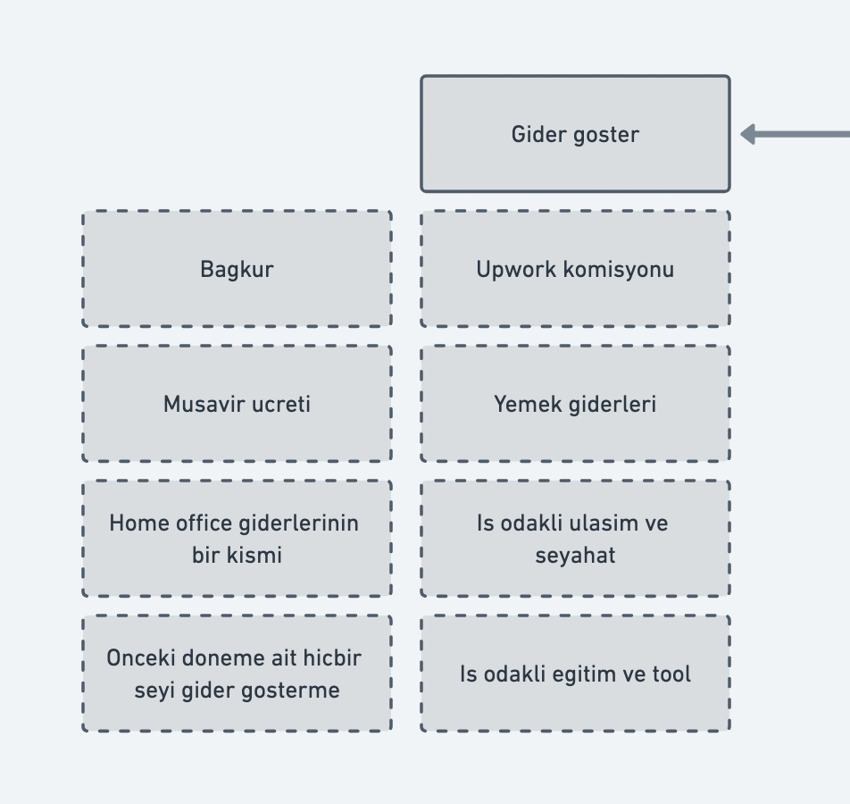
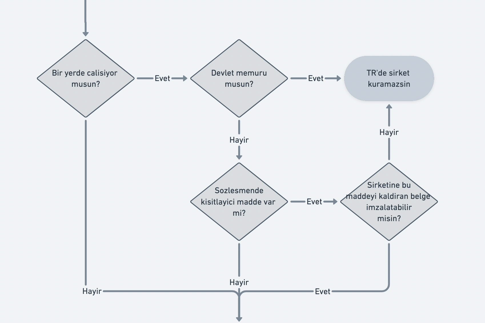
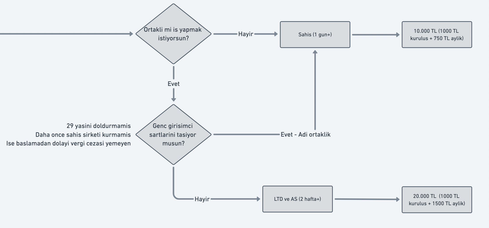
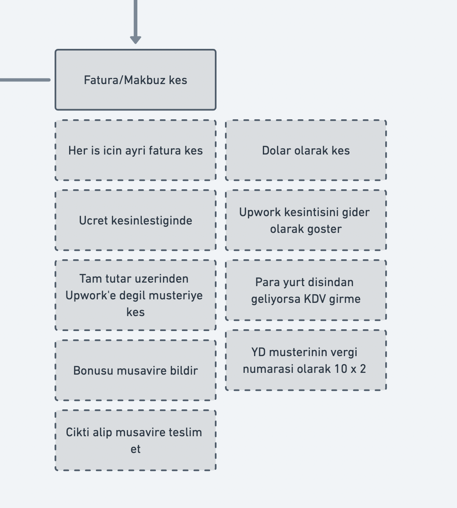

# Freelancerin Finansal Yol Haritasi
Upwork ve Fiverr uzerinden ihracat yapan Freelancer'in sirketlesme, tesvikler, parasini en uygun sekilde ulkemize getirme gibi konularda sorularina cevap bulabilecegi bir yol haritasi. Daja once [Freelancer Guide](https://freelancer.guide/)'in bir parcasi idi. Artik acik kaynak kodlu ve herkesin katkisina acik. Ilk katkilar her zaman oldugu gibi [Birlikte Ihracat](https://birlikteihracat.com/) toplulugu katkilariyla baslamistir.

Burasi musavirlik destegi vermiyor. Bu sayfayi lutfen genel kultur aktarimi olarak alin ve lutfen karar vermeden once musavire danisarak ilerleyin.

# Ozetin de ozeti
Eger yanlis bir kisim gorduysen bana [Twitter](https://twitter.com/zekeriyamulbay)'dan ulas veya [Discord](https://www.birlikteihracat.com/)'dan direkt yaz. Gerekli oldugunda uzerinde degisiklikler yaparak ilerleriz:
* Freelancer platformlarina kayit ol.
* Ilk isini almak icin ugras ve ilk isini al.
* Parani henuz cekme ve freelancerligin sana uygun olup olmadigini anlamaya calis.
* Gerekirse 1-2 is daha al.
* Eger buradan para kazanmayi dusunuyorsan sahis sirketi kur.
* Odemeleri sirket hesabina cek ve faturalarini kes.
* Mutlaka vergi ve tesviklerle ilgili genel kulture sahip ol.
* Temel duzeyde de olsa finansal okur-yazarlik okumasi yap.
* Varlik barisi ile ilgili sartlar ve son tarih surekli degistigi ucun lutfen musavirine danis.

# Gider gosterebilecegin kalemler
Asagida bazi "ornek" gider kalemleri yer aliyor. Isinle alakali harcamalari gider olarak gostermekten cekinme. Unutma, onlari harcayacaksin ki isini dogru ve verimli bir sekilde idame edesin.
* Upwork komisyonu
* Is ile alakali yemek/seyahat giderleri
* Egitim ve tool ucretleri
* Bagkur
* Musavir ucreti
* Sanal/fiziki ofis ucreti
* Onceki doneme ait hicbir seyi gider olarak gosterme.

# Genc Girisimci Destegi
Genç girişimci hepimizin aklını karıştıran bir konu. Daha önce upworkten para çektim. Youtuber arkadaşa olan benimde başıma gelir mi? diye içinize dert edindiğinizi biliyorum. Yurtiçi varlık barışı ile şirketinizi açtıktan sonra önceden çektiğiniz gelirleri beyan edebiliyorsunuz. Kanun açık ve net bir şekilde herhangi bir incelemeye yapılmayacağını vergi ödemeyeceğinizi söylüyor. Bu durumda aklınızda oluşan ilk aydınlanma artık genç girişimci olabileceğiniz yönünde. Evet haklısınız genç girişimci için olan yolunuzu açmış oluyorsunuz. Ama bir yandan devlete şirket açmadan önce iş yaptım demiş oluyorsunuz. Bu yüzden genç girişimci istisnasından yararlansanız bile incelemeye girdiğinizde hakkınız elinizden alınabilir ve yararlandığınız miktar ile orantılı olarak ceza yiyebilirsiniz.

Önceden getirdiğiniz gelirlerin vergilendirmeyeceği doğru. Fakat sektörel inceleme yapıldığında #upwork tagıyla sizin daha önce ne kadar gelir elde ettiğiniz bankalar tarafından alınabilir. Ben 300-400 dolarcık kazandım demeyin arkadaşlar, hali hazırda kurduğunuz şirket upwork üzerinden iş yapıyor olacak. Çok fazla açık var, etrafından dolanıp belki yararlanabilirsiniz. Fakat 5 yılın sonunda çok büyük bir problemle karşılaşma ihtimaliniz var. Bu riski alıp almamak tamamiyle sizin kararınız. Eğer yeni başladıysanız ve henüz para çekmediyseniz umut var. Bağkur ve %50 vergi indirimi ilk yılınız için ilaç gibi gelecektir. Dert edeceğiniz tek şey muhasebe ücreti olacaktır.

# Vergilendirme Ozet
* Yılın 185 günü nerede yaşıyorsan veya uyruğun neresi ise orada vergi veriyorsun - Paranın kaynağı neresi ise orada vergi verdin diyelim. Eğer, TR deki gelir oranı ile verdiğin vergi arasında fark var ise TR de farkı ödüyorsun. Yoksa ödemiyorsun. - Parayı y.dışında tutma ile TR ye getirme arasında bir fark yok. Neden yok? Çünkü, ülkelerin imzaladığı Ortak Bilgi Paylaşımı anlaşması çerçevesinde TR bu paralardan artık haberi var. Şu an ABD bu bilgi ağının dışında. Payoneer HQ USA' da, EU regülasyonuna da tabi olduğu için bilgiyi paylaşır veya talepte bulunan isteğe cevap verir.
* Arızi kazanç vs önemli değil, para geliyor ise 2 ayda 1, haftada 1 fark etmiyor, o şirket kurulacak.
* Para TR ye geldiğinde değil, Upwork te işe başladığınız tarihte faturayı kesmelisiniz. Bu konu TR de işler faturayı kestiğin an vergiye tabiisin. Mesela Estonya da ise bankadan parayı çektiğin an vergiye tabii olursun.
* Devlet seni denetler veya denetlemez, eğer olası bir incelemeden korunmak, sorumluluklarını yerine getirmek istiyorsan oyunu kuralına göre oynaman tavsiye ediliyor.
* 29 yaş altı isen çok avantajlı teşvikler var. Sadece geçmiş kazançların olmadan temiz bir başlangıç yapıyorsan çok iyi, öteki türlü geçmiş evrak bildirmemekten sıkıntı oluyor.
* 29 yaş üstü için ise şirket kurulum, Ssk, damga, stopaj, muhasebeci yıllık min 15.000TL-20.000TL masrafı var, bunu bil. SSK lı olarak bir yerde çalışıyorsan min 10.000TL daha az ödersin - Şu an sadece varlık barışı ile vergisiz para getirebilirsiniz. 2021 Haziran sonuna kadar geçerli. Bir ihtimal yıl sonuna doğru uzatılır.
* Malum herkes ya kazandı ya kazanacak. Oyunu kuralına göre oynamak isteyenler geriye dönük evrakları toparlamalı ve temiz bir başlangıç yapmalı. Piyango size de çıkabilir veya çıkmayabilir, tercih sizin.
Tesekkurler sevgili Burak!

# Calisan veya devlet memuru olarak sirket acabilir miyim?
Devlet memuru icin kisa cevap; Turkiye'de herhangi bir sirketten ticari gelir elde edemezsin. Bir yerde calisiyorsan aagidaki maddelere gore ilerleyebilirsin:

Sozlesmende baska bir sirket kurmani engelleyen bir madde var mi? Evet ise dilekce ile degistirebilir misin? Eger degistirebilirsen tebrikler. Sirket kurabilirsin; degistiremezsen sozlesmen geregi Turkiye'de sirket kuramazsin. Sozlesmende baska bir sirket kurmani engelleyen madde yoksa rahatlikla sirket kurabilirsin.

Eger hali hazirda bir yerde calisiyorsan bagkur odemesi yapmana gerek yok diye hatirliyorum. Lakin lutfen maas aldigin yere azami ozen gostererek aldigin maasin hakkini vermeyi unutma. Amacimiz hakkimiz olan geliri kazanmak, kimseyi zor durumda birakmak degil.

# Sahis sirketin icin ofis secenekleri
Onunce 3 secenek var. Kendi evinle ilerleyebilir, kiraci olarak ev sahibinde anlasabilir veya sanal/fiziki ofis ile anlasabilirsin.

## Kendi evin var
En guzel ve temiz secenek kendi evini gostermek. Herhangi bir ek masraf cikmiyor.

## Kiracisin
Eger kiradaysan ilk yapman gereken ev sahibinle evin is yeri adresi olarak kullanilmasini konusmak. Izin vermesi durumunda yaptiginiz sozlesmeyi guncellemeniz gerekebilir. Bu secenekten ilerliyorsan atlamaman gereken konu stopaj odemesi.

Netten Brüte Kira Bedeli = 2000 / 0,8 = 2500 TL Stopaj Tutarı = 2500 x 0,2 = 500 TL

## Sanal Ofis
Sanal ofise yaptigin harcamalarin tamamini gider olarak gosterebiliyorsun. Ayrica bu ofislerin bir kismi her hafta belirli saatler arasinda fiziki olarak da calisma imkani sunuyor. Freelancerin en buyuk dertlerinden biri de sosyallesmek, digeri de evde verimli calisamamak. Bu 2 problemin cozumu de ara sira da olsa fiziki olarak ofislere gitmekten geciyor.

# Freelancer olarak hangi sirket turunu secmeliyim?
Bu dokuman karsindaki butun secenekleri degil en elverisli birkac secenegi onune dokuyor. Bu secenekler tanidigim freelancer'larin cogunun gectigi yollar. Baska yollar var mi? Tabi ki var ama %10'luk dilime girdigi icin enerjimi buraya harcamayi tercih etmiyorum. Ornegin; anonim sirket konusunu hic acmayacagim. 🤷🏻‍♂️

Sorularimiza baslayalim hadi. Ilk sorum; ortakli mi is yapmak istiyorsun? Cevabin evet ise diger sorum genc girisimci satlarini tasiyor musun? Buna da cevabin evet ise adi ortaklik degilse limited sirket acmani oneririm.

Ortaksiz ilerleyeceksen her turlu sahis sirketi ile "baslamani" oneririm. Sonrasinda gelirine gore Limited'e rahatlikla gecebilirsin. Bu asamada vergi avantajindan cok kafani en az agritacak sirket turunu sec ki esas osaklanman gereken kisma yani freelancer olarak gelir urtemeye daha fazla enerji ayirabil.

## Acilis Sureleri
Sirket acilis sureleri degiskenlik gosterse de kabaca asagidaki sureleri verebilirim:
Sahis → 1+ gun
Limited ve Anonim → 2+ hafta

## Genc Girisimci Tesvigi
En basit haliyle asagida sartlari sagliyorsan bu tesvikten yararlanabilirsin:
* 29 yasini doldurmamis
* Daha once sahis sirketi kurmamis
* Ise baslamadan dolayi vergi cezasi yemeyen

# Sahis sirket kurulum maliyeti
Dokumandan anladigin uzere burun hesaplamalari "kabaca" sunuyorum. Maliyetleri de bu sekilde verecegim. Dogal olarak herkesin kendi ozel durumuna gore bu miktar artabilir (azalmasi zor).

Eger sahis isletmesi kuruyorsaniz ve genc girisimci desteginden faydalaniyorsaniz yillik maliyetiniz yaklasik 10bin TL civarinda olacak. 1000 TL gibi bir kurulus ucretinin yaninda aylik 750TL'lik gideriniz olacak.

Genc girisimci desteginiz yoksa ve/veya limited sirket kuruyorsaniz yillik gideriniz yaklasik 20bin TL olacak. 1000 TL civari kurulus ucretinin yaninda aylik 1500 TL'lik gider. (Bagkur odemesine gore bir miktar yukari cikabilir)

Asagidaki maliyetleri Discord icindeki bir mesajdan aldim. Birkac ay once limited sirket acilisi icin kullanilan liste:
* Şahıs imza beyannamesi (Noter) 100 TL
* Muhasebeci Vekaleti (Noter) 148 TL
* Şirket Kuruluş Servis Bedeli: 250 TL
* Vergi Dairesi Sözleşme Damga Vergileri: 50 TL
* Toplam şahıs şirketi kurma maliyet: 550 TL
* Şahıs Şirketi Sabit Giderler Ne Kadar?
* 3 ayda bir stopaj (sözleşme yapılan yer kira ise)
* Her ay KDV beyannamesi (58,80 TL damga vergisi)
* 3 ayda bir muhtasar beyannamesi (58,80 TL damga vergisi)
* 3 ayda bir gelir geçici beyannamesi (91,70 TL damga vergisi)
* Yıllık gelir vergisi beyannamesi (122 TL damga vergisi)
* Şahıs Şirketi Kurmak İçin Gerekli Evraklar Nelerdir?
* Mali Müşavir vekaleti
* Tapu fotokopisi ya da kira kontratı
* Nüfus cüzdan sureti
* Vesikalık fotoğrafı
* İmza beyannamesi(noterden)
* İkametgah
* Araç Alış Senedi ve Ruhsat (Varsa)

## Hangi muhasebe yazilimini kullanmalisin?
Sadece freelancer platformlari uzerinden calisacaksan e-donusum destekli yazilim yeterli ama yanlis kesilan faturanin duzeltilmesi ve gelen fatura takibinin olmamasi gibi problemleri de yaninda getiriyor.

Eger gelir kalemlerin daha cesitli olacaksa ve Gelir/gider takibi yapabilmek istiyorsan bu sefer Parasut (1000 TL + KDV) veya Logo Is Basi (600 TL _ KDV) gibi programlari kullanmak gerekecek.

# Freelancer nasil fatura kesmeli?
* Her is icin ayri fatura kesmelisin.
* Odemeyi aldiginda degil ucret kesinlestiginde kesilmeli.
* Tam tutar uzerinden (freelancer platformlarinin ucretleri dusulmeden) platforma degil son musteriye kesilmeli
* Bonusu ayrica musavirine bildirmelisin
* Hangi para birimiyle is aldiysan o birimde faturayi kesmelisin.
* Upwork ve diger platform kesintilerini gider olarak muhasebelestirmelisin.
* Para yurt disindaki musteriden geliyorsa KDV girme, musteri veri numarasi olarak 10 adet 2 girebilirsin.
* Upwork/freelancer isinin ID'si ve adi da aciklama kismina yazilirsa guzel olur.

## Fatura mi kesecegim yoksa makbuz mu?
Bunu belirlemek icin sormak istedigim ilk soru serbest meslek erbabi misin?

Serbest meslek faaliyetini kendi nam ve hesabına, mutat meslek halinde ifa eden; avukat, doktor, diş hekimi, veteriner hekim, mimar, mühendis, müşavir, serbest muhasebeci mali müşavir, yeminli mali müşavir, danışman, ressam, yazar, bestekar, kimyager, noter, öğretmen, artist, menajer, senarist, yönetmen, ebe, sünnetçi, arzuhalci, rehber ve sağlık memuru vb. kişiler serbest meslek erbabıdır.

Eger gelirin serbest meslek kazancina giriyorsa E-SMM'ye; degilse e-faturaya absvurmam gerekiyor. Gelin yine madde madde aciklayalim:

Serbest meslek erbabi misin?
* Evet → E-SMM'ye basvur → E-imza al → Makbuz kes
* Hayir → E-faturaya basvur → Fatura kes (Sahis sirketi → E-imza, Diger sirket turleri → Mali muhur)

## Faturayi hangi ulkeye kesiyorsun?
Freelancer platformlari uzerinden calisiyor olsaniz da paraniz yurt disindan gelse de eger is yaptiginiz son musteri Turkiye'de yerlesik ise faturayi + KDV ile kesmeniz gerekiyor. Stopaj da var ama gider gosterilebildigi icin hesaba katmaya gerek yok.

Yurt disi yerlesik musteriler icin stopaj da KDV'de yok.

## Faturayi kime kesmeliyiz?
Business literatüründe platformlar çeşitli alt kollara ayrılır. Şu anki tartışmaya ilişkin en faydalı olabilecek alt kollar şu şekilde: - Marketplaces (e.g. AirBnB, Booking, Amazon, Udemy, E-Bay, Upwork, Fiverr, etc), - On-Demand Platforms (e.g. Uber, Glovo), - Classified Platforms (Craigslist, Letgo, etc) Classified Platforms --> Platformda ilan vermek için para ödersiniz. Value/Money transfer, platform DIŞINDA gerçekleşir. Upwork, transaction'ı kendi üzerinden geçirdiği için Classified değil. On-Demand Platforms --> Bu platform tipinde transaction, platform üzerinden geçer ve platform transaction üzerinden bir "take-rate" keser. Platform üzerinde kendi ürün/hizmetinizle bulunamazsınız; platformun belirlediği standartlara uymanız gerekir. Ek olarak; taşıdığınızı yolcuyu da bilmezsiniz; Uber kendi müşterisine taşıma hizmeti verirken sizi "outsource" olarak kullanmış olur. Bu durumda Uber sürücüsü olarak faturayı Uber'e kesersiniz. Marketplaces --> Bu platform tipinde transaction, platform üzerinden geçer ve platform transaction üzerinden bir "take-rate" keser. Platform üzerinde kendi ürün ve hizmetinizle bulunabilirsiniz. Platform size herhangi bir standardizasyon uygulamaz. Ek olarak; hizmet verdiğiniz şahıs ya da kurumu detaylı olarak tanırsınız. Platform, işin kaliteli olması durumunda ekstra ödül, kalitesiz olması durumunda ise cezaya katlanmaz (Ajans/Consulting modelinden farklar). Bu durumda ise Upwork/Fiverr, etc platformda hizmet veren kişi olarak faturayı, hizmet verdiğiniz müşteriye kesersiniz, platformun sizden aldığı "take-rate" miktarını da gider göstererek muhasebeleştirirsiniz.On-Demand ve Marketplace paltformlar birbirleriyle karıştırılması kolay olan iş modelleri. Aralarındaki en büyük fark; standardizasyon ve hizmet verdiğiniz müşteriyi tanıma/tanımama durumuFatura keserken, NOT alanına şu notları mutlaka ekliyorum: - Hizmet İhracatı kapsamında KDV oranı %0 olarak hesaplanmıştır - Upwork Invoice ID - Upwork Invoice file ID (pdf'in isminde yazan ID ile Invoice ID farklı oluyor -- aralarında genelde 2 fark oluyor) - Upwork Contract Number

Banka transaction'ında parayı gönderen olarak Upwork yazabilir. Herhangi bir soru sorulması durumunda, bu geliri Upwork üzerinden, ilgili müşterilere faturaları keserek elde ettiğinizi ispat edebilirsiniz. Ek olarak; zaten para size gelirken Upwork'ten \$1000 olarak yola çıksa bile sizin hesabınıza gelene kadar yolda kesintiler olacak. Bu durumda da zaten miktarda uyuşmazlık olacak. Buna karşılık; "para bana ulaşınca, ulaşan miktar kadar keseyim o halde" tezi ise, modern muhasebede takip edilen, 'Gelirin hak kazanıldığı zaman, giderin ise oluştuğu zaman muhasebeleştirilmesi gerekliliği' ilkesine ters düşecektir (Bknz. Accrual Accounting vs Cash-Based Accounting)

Tüm bunlar düşünüldüğünde; aslında takip edilmesi gereken usul oldukça net görülebiliyor: Faturayı müşteriye kes, upwork kesintisini ise gider olarak göster. Geliri de gideri de banka hesabına gelmesini beklemeden, oluştuğu tarihte muhasebeleştir.

# Kazancinizi Turkiye'ye en az kesintiyle getirmek
Payoneer aracılığıyla \$ hesabına ve direct to local bank yöntemiyle TL hesabına aktarım arasındaki farkı gösteren bir hesaplama yaptım herkesin kafasında bir fikir oluşması için yardımcı olur umarım. (anlık kur -7.94- ve banka olarak enpara baz alındı.)

\$200.00 (1,588.00TL)için Payoneer ile \$ hesabına;
* 2\$ Upwork kesiyor kaldı \$198.00
* \$ hesabına aktarım için Payoneer %2 kesiyor kaldı \$194.04 -194.04x7.94=1,540.68 TL
* En para swift işlemi başına 20TL ücret alıyor. -Elimize geçen para net olarak 1,520.68 TL -Kesilen miktar \$8.48 yani 67.32TL

\$200.00 (1,588.00TL)için direct to local bank ;
* 0.99\$ Upwork kesiyor kaldı \$199.01
* Upwork'ün belirlediği kur 7.70
* Enpara bu yöntemde herhangi bir aktarım ücreti almıyor.
* Elimize geçen para 199.01x7,70=1.532,38TL
* Kesilen miktar \$7.00 yani 55.62TL

\$500.00 (3,970.00TL)için Payoneer ile \$ hesabına;
* 2\$ Upwork kesiyor kaldı \$498.00
* \$ hesabına aktarım için Payoneer %2 kesiyor kaldı \$488.04
* 488.04x7.94=3,875.04 TL
* En para swift işlemi başına 20TL ücret alıyor.
* Elimize geçen para net olarak 3,855.04 TL
* Kesilen miktar \$14.48 yani 114.96TL

\$500.00 (3,970.00TL)için direct to local bank ;
* 0.99\$ Upwork kesiyor kaldı \$499.01
* Upwork'ün belirlediği kur 7.70
* Enpara bu yöntemde herhangi bir aktarım ücreti almıyor.
* Elimize geçen para 499.01x7,70=3,842,38TL
* Kesilen miktar \$16.07 yani 127.62TL

\$1,000.00 (7,940.00TL)için Payoneer ile \$ hesabına;
* 2\$ Upwork kesiyor kaldı \$998.00
* \$ hesabına aktarım için Payoneer %2 kesiyor kaldı \$978.04
* 978.04x7.94=7,765.64 TL
* En para swift işlemi başına 20TL ücret alıyor.
* Elimize geçen para net olarak 7,755.64 TL
* Kesilen miktar \$23.22 yani 184.36TL

\$1,000.00 (7,940.00TL)için direct to local bank ;
* 0.99\$ Upwork kesiyor kaldı \$999.01
* Upwork'ün belirlediği kur 7.70
* Enpara bu yöntemde herhangi bir aktarım ücreti almıyor.
* Elimize geçen para 999.01x7,70=7,692.38TL
* Kesilen miktar \$31.19 yani 247.62TL

\$1,000.00 (7,940.00TL)için wire transfer yöntemi;
* 30.00\$ Upwork kesiyor kaldı \$970.00
* 970.00x7,94=7,701.80TL
* En para swift işlemi başına 20TL ücret alıyor.
* Elimize geçen para net olarak 7,681.80 TL
* Kesilen miktar \$32.52 yani 258.20TL

Normal koşullarda direct to local bank yöntemiyle para 24 saat içinde hesaba geçiyor.(Benim genelde min 12 saat sürdü.) Payoneer yönteminde para çok kısa bir süre içinde Payoneer'a aktarılıyor. Payoneer'dan enpara \$ hesabıma aktarmak da 1,5 saat sürdü.

Wire transfer yöntemini hiç kullanmadım.

Benim düşüncem düşük miktarlı işlemlerde direkt TL hesabına aktarmak daha mantıklı. +\$500.00 olduğunda da Payoneer daha mantıklı. (tam kırılma noktasını hesaplayamadım malesef.)

Yukaridaki mesaj icin Oguz'a tesekkur ederim.

# Yurtdışına para gönderimi ve alımı süreci
Yurt dışına para gönderimi ve alımı şöyle oluyor. Eğer gönderen ve alan banka muhabir banka değilse.
1- Hesabınızın olduğu bankadan muhabir bankaya talimat gider.
2- Muhabir banka bunu swift sistemine iletir.
3- Swift sisteminden karşı muhabir bankayı iletilir.
4- arşı muhabir bankadan karşı hesabın olduğu bankaya iletilir.
5- Karşı banka ilgili hesaba parayı yatırır.

Madde haricinde olan adımların hepsinde manuel onay oluyor. Bundan dolayıdır ki bazen yurtdışına para gönderimlerin/alımlarında süreler uzayabiliyor. Bu süreyi kısaltmanın yöntemleri var. Fakat eğer gönderen siz değilseniz bu süreyi kısaltmanız tamamen karşı taraftan gönderene kalıyor. Karşı taraf eğer bir kurumsa bunu kendine göre komisyonu uygun olacak şekilde yapıyor. (Yani en hızlı şekilde olmuyor genelde.) Swift işlemleri ile alakalı birkaç bilgi daha vereyim. Eğer siz para gönderen olacaksanız veya alıcı olun (Karşıdaki gönderen kişi/birey ise), swift formunu doldurduğunuzda (eskiden kağıt formu doldururdunuz, çoğu banka internet sitelerini yeni yeni getiriyor bunu.) maliyetin nasıl kesileceğinine dair alan görürsünüz. değerleri our/sha/ben bunlardır. - Our tüm komisyonları (hem gönderen hemde alıcı tarafındaki) gönderdiğim miktardan kesme ben sana bunu vereceğim ayrıca demek oluyor. - Sha gönderen tarafındakileri ben ödeyeceğim alıcı tarafındakileri ise giden paradan kesip kalanı alıcıya ödeyin. - Ben ise tüm komisyonları giden paradan kesip kalanı alıcıya iletin demek oluyor. Peki hızlı nasıl para gönderiliyor. Aynı şekilde para gönderirken sizden işlem tarihini ister (yani bu para en yakın hangi tarihte karşıya ulaşsın). Eğer bugünü seçerseniz sizden en yüksek komisyon tutarları ile gönderim yapıp karşıya aynı günde iletirler. (öğleden önce gönderirseniz ulaşır, öğleden sonra bir sonraki güne ulaşır.) Normalde işlem süresi 3-4 iş günüdür. Bugünkü bankacılık dersimizin de sonuna geldik .

Tesekkuler Mehmet!
